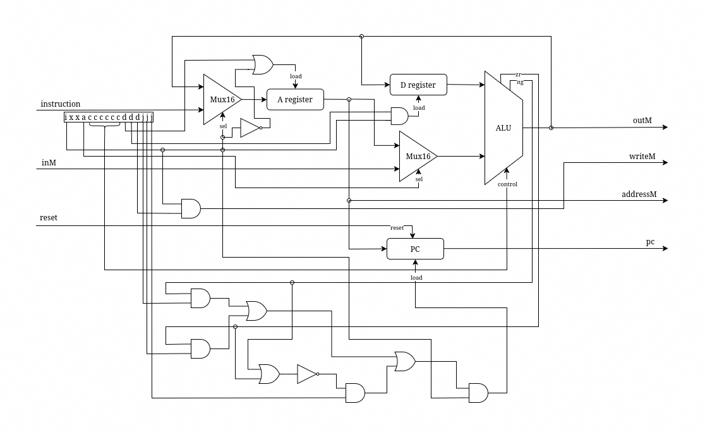

# hack-computer

A complete hardware implementation of the Hack computer architecture in HDL, 
developed as part of the [Nand2Tetris](https://www.nand2tetris.org/) course (Projects 1–3, 5).

Built from the ground up: starting with nothing but NAND gates and D flip-flops, 
culminating in a fully functional 16-bit computer.

## CPU Architecture



## Usage

All chips can be loaded and tested in the
[Nand2Tetris Hardware Simulator](https://www.nand2tetris.org/software).

## Project Structure
```
hack-computer/
├── 01-logic-gates/   # Elementary gates (Not, And, Or, Xor, Mux, DMux, ...)
├── 02-arithmetic/    # Adders and ALU chip
├── 03-memory/        # Registers, RAM, and Program Counter
├── 05-computer/      # CPU, Memory, and top-level Computer chip
└── cpu-diagram.png   # Detailed circuit diagram for the CPU
```